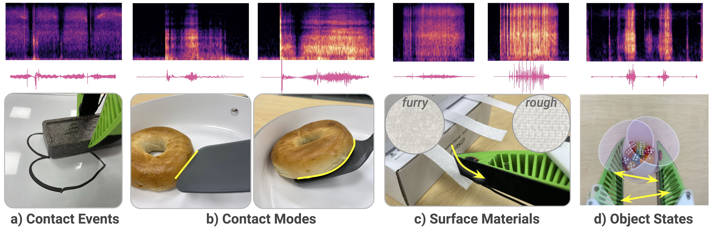

# ManiWAV: Learning Robot Manipulation from In-the-Wild Audio-Visual Data

[[Project page]](https://mani-wav.github.io/)
[[Paper]](https://arxiv.org/abs/2406.19464)
[[Dataset]](https://real.stanford.edu/maniwav)

<p align="center">

</p>

[Zeyi Liu](http://lzylucy.github.io/) <sup>1</sup>,
[Cheng Chi](http://cheng-chi.github.io/)<sup>1,2</sup>,
[Eric Cousineau](https://www.eacousineau.com/)<sup>3</sup>,
[Naveen Kuppuswamy](https://naveenoid.wordpress.com/)<sup>3</sup>,
[Benjamin Burchfiel](http://www.benburchfiel.com/)<sup>3</sup>,
[Shuran Song](https://www.cs.columbia.edu/~shurans/)<sup>1,2</sup>

<sup>1</sup>Stanford University,
<sup>2</sup>Columbia University,
<sup>3</sup>Toyota Research Institute

## Preparation
The hardware and software is built on top of Universal Manipulation Interface (UMI). Please review the UMI paper and [UMI GitHub repository](https://github.com/real-stanford/universal_manipulation_interface) beforehand to learn about the context.

## Software Installation
Please refer to the [UMI repository](https://github.com/real-stanford/universal_manipulation_interface) for installing docker and system-level dependencies.

We provide a new `conda_environment.yaml` with additional dependencies. To create a conda environment named maniwav:
```console
$ cd maniwav
$ mamba env create -f conda_environment.yaml
$ conda activate maniwav
(maniwav)$
```

If you see a <i>PortAudio not found error </i> when installing the `sounddevice` package, run
```console
sudo apt-get install libportaudio2
```

## Hardware Installation
<p align="center">

</p>

To add contact microphone to the UMI gripper:
- Download the gripper CAD model with microphone holder: 
    ```console
    wget https://real.stanford.edu/maniwav/CE3S1_soft_finger_contact_mic.gcode
    ```
- Contact microphone (x2): https://www.amazon.com/gp/product/B08RBSQ7QD/ref=ppx_yo_dt_b_search_asin_title?ie=UTF8&psc=1
- Cable (x2): https://www.amazon.com/gp/product/B09Z2FFZST/ref=ppx_yo_dt_b_search_asin_title?ie=UTF8&th=1
- Grip tape: https://www.amazon.com/gp/product/B0093CQPW8/ref=ppx_yo_dt_b_search_asin_title?ie=UTF8&psc=1
- Soft gripper printing material (green): https://ninjatek.com/shop/ninjaflex/

For the rest of the device, please see the [UMI hardware guide](https://docs.google.com/document/d/1TPYwV9sNVPAi0ZlAupDMkXZ4CA1hsZx7YDMSmcEy6EU/edit) for reference.


## Dataset
We release the in-the-wild bagel flipping dataset and policy checkpoint at https://real.stanford.edu/maniwav/, which you can try directly training/evaluating on your own robot. You are encouraged to organize all your dataset under the `data/` folder under the root directory.

Download the zarr dataset:
```console
wget https://real.stanford.edu/maniwav/data/bagel_in_wild/replay_buffer.zarr.zip
```
Download the original demo videos with SLAM results (can be skipped if you don't need the raw mp4 videos):
```console
wget --recursive --no-parent --no-host-directories --cut-dirs=2 --relative https://real.stanford.edu/maniwav/data/bagel_in_wild/demos/
```

If you have your own data (namely mp4 videos with sound, and actions extracted from SLAM following the same procedure as UMI), you can run the following script to create a replay buffer with audio data. Check the `demos` folder for the expected file structure.
```console
python scripts_slam_pipeline/07_generate_replay_buffer.py <your-dataset-folder-path> -o <your-dataset-folder-path>/replay_buffer.zarr.zip -ms
```

Follow this link to download the ESC-50 dataset for noise augmentation, place the folder under `data/`: https://github.com/karolpiczak/ESC-50#download.
For robot noises, we provide an example under `data/robot-noise-calib` for a UR5 robot, but you are encouraged record the noises for your specific robot.

## Training
<p align="center">

</p>

Tested on NVIDIA GeForce RTX 3090 24 GB.

Multi-GPU training with accelerator example:
```console
CUDA_VISIBLE_DEVICES=<GPU-device-ids> HYDRA_FULL_ERROR=1 accelerate launch --multi_gpu --num_processes <ngpus> --main_process_port 29501 train.py --config-name train_diffusion_unet_maniwav_workspace task.dataset_path=data/replay_buffer.zarr.zip training.num_epochs=60 dataloader.batch_size=64 val_dataloader.batch_size=64
```

Single-GPU training example:
```console
python train.py --config-name train_diffusion_unet_maniwav_workspace task.dataset_path=data/replay_buffer.zarr.zip training.num_epochs=60 dataloader.batch_size=64 val_dataloader.batch_size=64 training.device=<GPU-device-id>
```

## Real World Evaluation
Congratulations🎉! Up to this point, you already have a robot manipulation policy ready to be deployed in the real world. Tested on Ubuntu 22.04. Please review the [UMI documention](https://github.com/real-stanford/universal_manipulation_interface?tab=readme-ov-file#-real-world-deployment) on real world evaluation first.

Example to run the evaluation script:
```console
python scripts_real/eval_real_umi.py --audio_device_id 0 --input checkpoints/bagel_in_wild/in-the-wild-latest.ckpt --output outputs/ours_itw --camera_reorder 0 -md 120 -si 4
```

To check audio device ids, run:
```console
python -m sounddevice
```

Refer to the UMI repository for setting up the robot and camera. For microphone, just put contact microphone inside the gripper holder, wrap around with grip tape, and use cable to connect the microphone to the GoPro media mode external mic port. The game capture card will stream both vision and audio to the desktop, and we provide code to read and record audio data automatically. Check the files under `umi/real_world`.

NOTE: Remember to calibrate the audio latency following Appendix A.1, and update the number [here](https://github.com/real-stanford/maniwav/blob/3f15f6b16b4de2eeaab7390ad56ab5705e69d045/scripts_real/eval_real_umi.py#L166).

## Contact
If you have questions about the codebase, don't hesitate to reach out to [Zeyi](https://lzylucy.github.io/). If you opened a GitHub issue, please also shoot me an email with the link to the issue.

## License
This repository is released under the MIT license. See [LICENSE](LICENSE) for additional details.

## Acknowledgements
- Cheng Chi and Huy Ha for early discussions on the hardware design and codebase.
- Toyota Research Institute (TRI) for generously providing the UR5 robot and advice on using UMI. 